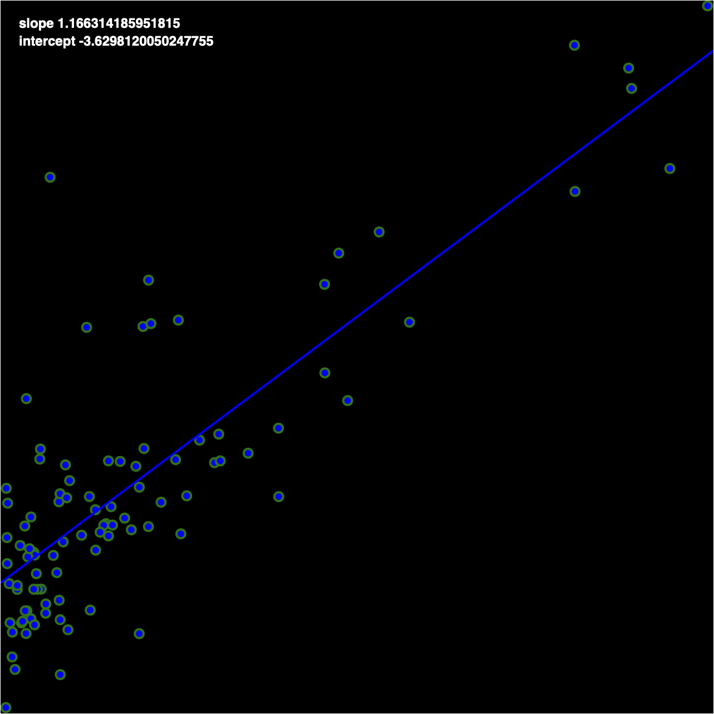
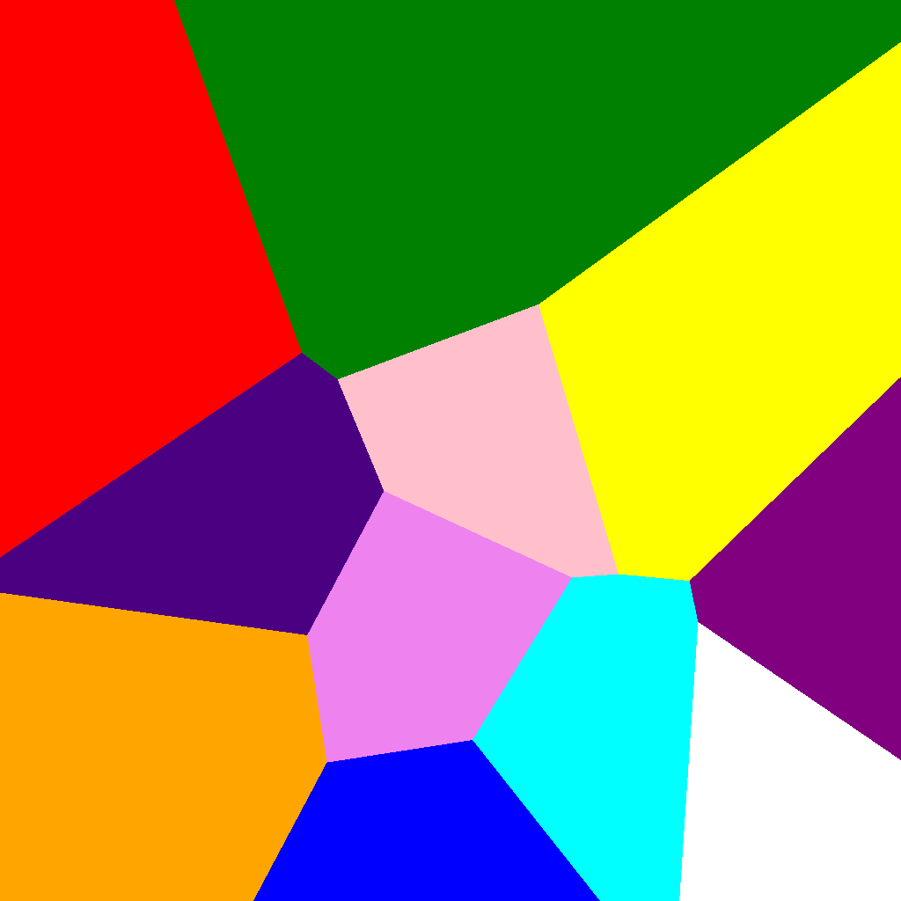

## gradient-descent-ml

implements the gradient descent line-to-point fitting from andrew ng's coursera machine learning course

## least-squares-alignment

attempt to find the best-fit alignment, using [linear least squares](https://en.wikipedia.org/wiki/Linear_least_squares) iirc for multiple triangles

## optimization-circle-rectangle

using a semicircle as a constraint, determine the largest rectangle that can be inscribed

## verlet integration

[verlet integration](https://en.wikipedia.org/wiki/Verlet_integration)

## voronoi

[voronoi diagram](https://en.wikipedia.org/wiki/Voronoi_diagram)

