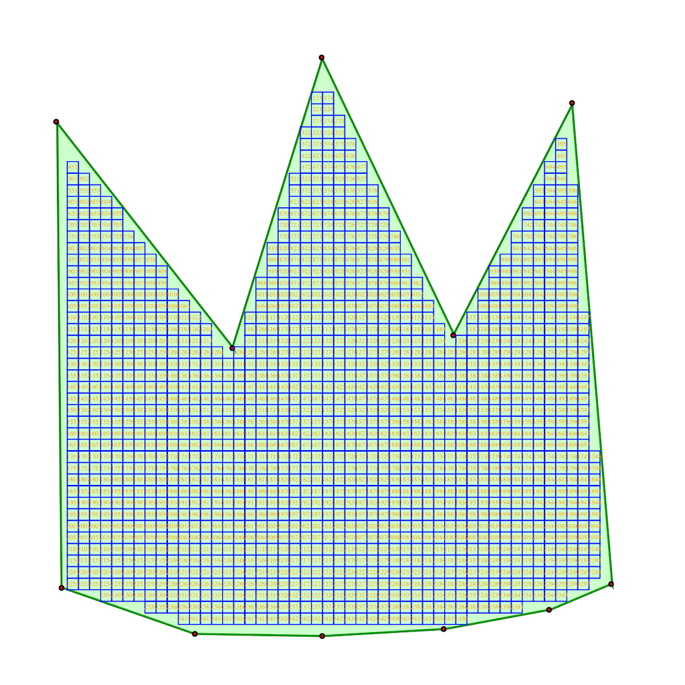
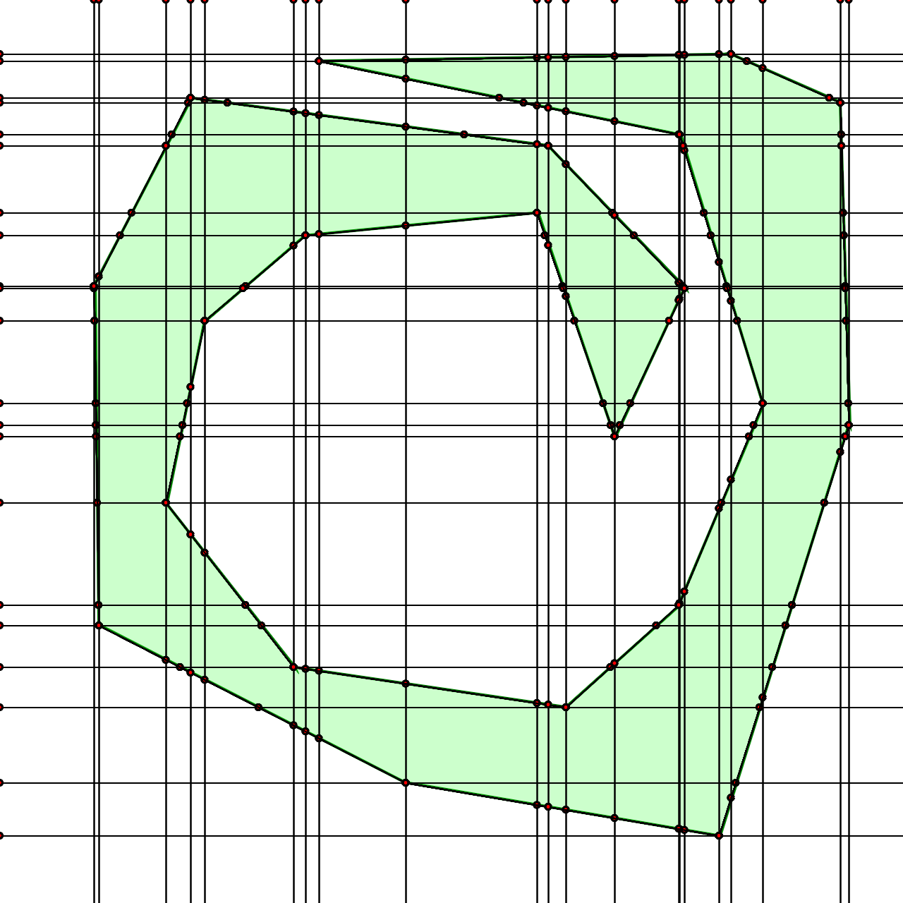

## polygon-to-rectangles

various interactive js scripts to:

1. draw a polygon and
2. either fill it with rectangles or
3. figure out its subdivisions

uses point-in-polygon, along with ray tracing, to determine the above
i believe it also makes assumptions about orientation/order of the polygon points, as well as concavity

## polygon-to-rectangles-grid

see `polygon-to-rectangles`, packs the shape with as much squares as possible

## polygon-to-rectangles-slices

see `polygon-to-rectangles`, subdivides the shape into squares with lines

